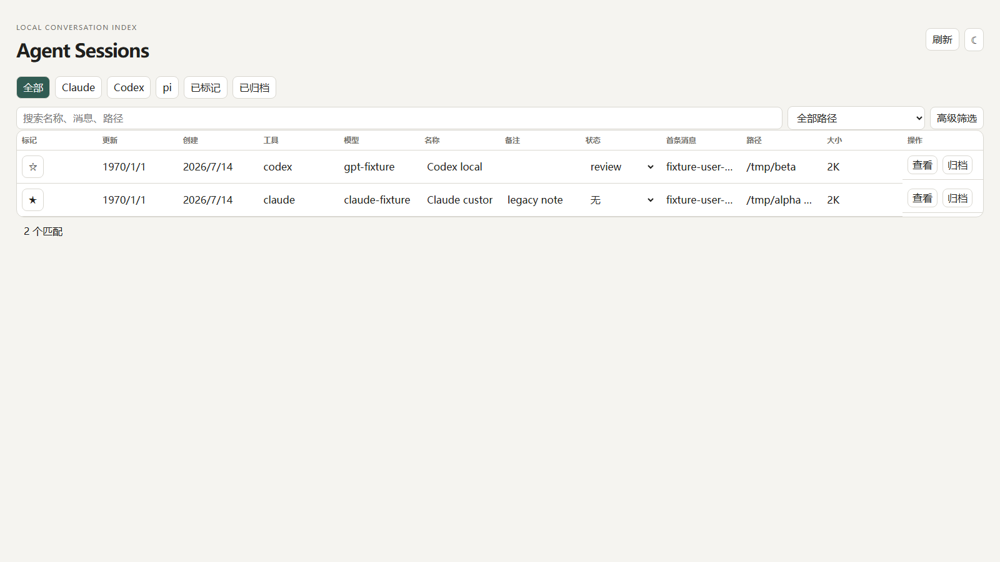

# agent-sessions

Search your Claude Code / Codex / pi session history across all project directories. A single-file Python script with zero third-party dependencies (only [ripgrep](https://github.com/BurntSushi/ripgrep) required).

[中文文档](README.zh-CN.md)

The pain point it solves: CLI agents only list resumable sessions for the current directory. Open a different directory and your past conversations seem gone. They are not: every conversation is stored on disk in full. What is missing is a cross-directory search entry, and that is all this tool is.

## Install

```bash
cp sessions ~/.local/bin/ && chmod +x ~/.local/bin/sessions
# Requires: python3 (stdlib only), ripgrep (rg)
```

## Usage

```bash
sessions list -n 30              # recent sessions, all paths, all three tools
sessions list claude             # single tool (claude / codex / pi)
sessions find "keyword"          # full-text search across all history via rg
sessions star 48e17d64 note     # star a session by id prefix, with optional note
sessions unstar 48e17d64        # remove a star
sessions stars                   # list starred sessions
sessions dash                    # open the dashboard (resident localhost service)
sessions dash --stop             # stop the dashboard service
```

Every result comes with a copy-pastable resume command (`claude -r` / `codex resume` / `pi --session`). Claude and pi must be resumed from the original directory, so the command includes the `cd`.

## Dashboard



`sessions dash` starts a resident micro-service on `localhost:7867` (python stdlib `http.server`):

- Name column: Claude's `/rename` custom title > AI-generated title; pi's `--name`
- Star / edit notes in the page; changes POST back to `stars.json`, shared with the CLI
- Composable filters: keyword, tool, path (dropdown with counts), created/updated date ranges, size range
- Click a row to copy its resume command; draggable column widths (persisted in localStorage); light/dark theme toggle
- Data cached for 30 seconds; the refresh button forces a rescan

Styling follows the Linear (midnight precision instrument) DESIGN.md from [refero styles](https://styles.refero.design/).

## Data sources

| Tool | Location | Notes |
|---|---|---|
| Claude Code | `~/.claude/projects/<path-slug>/*.jsonl` | names from `custom-title` / `ai-title` records inside the jsonl |
| Codex | `~/.codex/sessions/YYYY/MM/DD/rollout-*.jsonl` | first line is `session_meta` |
| pi | `~/.pi/agent/sessions/<path-slug>/*.jsonl` | first line is `type=session` |

The tool scans session files read-only. Star data lives in `~/.local/share/session-snapshots/stars.json`.

Note: Claude Code deletes sessions after 30 days by default (`cleanupPeriodDays`). Raise it in `~/.claude/settings.json` if you want long-term history.

## Cross-platform

Linux / WSL / macOS. Browser opening is auto-detected (`explorer.exe` on WSL, `open` on macOS, `xdg-open` otherwise).

Known pitfall: a `~/.claude/.gitignore` file makes rg silently skip the whole subtree, so every rg call in the script uses `--no-ignore --hidden`.
