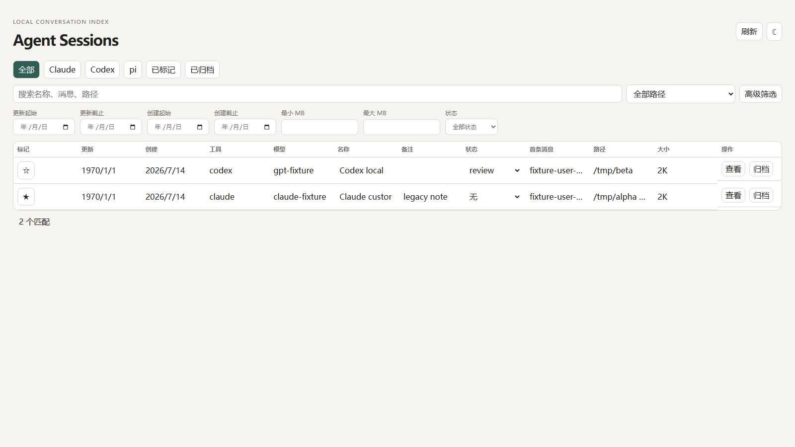
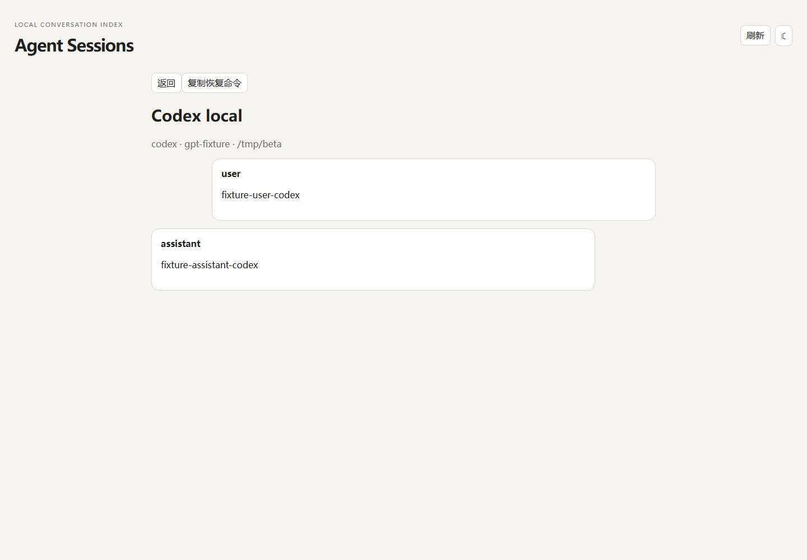

# agent-sessions

Search Claude Code, Codex, and pi Session history across every project directory.
The CLI and localhost dashboard ship as one Bun executable with an embedded Vue
application. The only external runtime dependency is
[ripgrep](https://github.com/BurntSushi/ripgrep).

[中文文档](README.zh-CN.md)

## Install

Download the artifact for your OS and architecture from GitHub Releases, rename
it to `sessions` (`sessions.exe` on Windows), and put it on `PATH`. Release
artifacts target Linux, macOS, and Windows on x64 and ARM64.

To build from source, install Bun 1.3.14 and `rg`, then run:

```bash
bun install --frozen-lockfile
bun run compile
install -m 755 build/sessions ~/.local/bin/sessions
```

## Usage

```bash
sessions list -n 30              # recent Sessions across all tools and paths
sessions list claude             # one tool: claude / codex / pi
sessions find "keyword"          # full-text search through rg
sessions star 48e17d64 note      # star an id prefix, with an optional note
sessions unstar 48e17d64
sessions stars
sessions dash                    # start/open the resident localhost dashboard
sessions dash --stop
```

Resume commands use the Session's original working directory and last model.
POSIX systems receive safely quoted shell commands; native Windows receives a
safely quoted PowerShell command.

## Dashboard

### Session overview


### Filters and status



### Transcript detail



The dashboard binds only to `127.0.0.1:7867` and provides:

- all/tool/starred/archived tabs, keyword/path/date/size/status filters, sortable
  columns, 100-row pagination, and forced refresh;
- row-click resume-command copying, query-string Transcript detail navigation,
  hover preview, theme and draggable-width preferences;
- inline stars, notes, names, statuses, and archive state with recoverable errors;
- Claude `/rename` append behavior, pi first-line rename behavior, and a local
  Codex name override;
- reduced-motion, reduced-transparency, high-contrast, and keyboard affordances.

Lifecycle metadata contains a validated pid, port, and random nonce. Start and
stop only trust a normal GET health response that echoes the nonce; an unrelated
process on the port is never taken over.

## Data and privacy

| Tool | Session source |
| --- | --- |
| Claude Code | `~/.claude/projects/<path-slug>/*.jsonl` |
| Codex | `~/.codex/sessions/YYYY/MM/DD/rollout-*.jsonl` plus read-only indexes |
| pi | `~/.pi/agent/sessions/<path-slug>/*.jsonl` |

Scanning, search, list, detail, and refresh are read-only. Explicit rename is the
only write to a Session file. Marks remain compatible with the existing
`stars.json` at `~/.local/share/session-snapshots/` on POSIX and the platform
local application-data directory on native Windows.

## Development

```bash
bun run test                 # Bun seam tests + Vue DOM tests
bun run typecheck            # vue-tsc --noEmit
bun run build                # Vite build + inline assets
bun run compile              # host standalone executable
bun scripts/real-data-check.ts  # read-only shape/count check, no Transcript text
```

Tag builds compile all six targets, generate SHA-256 files, run host x64 smoke
tests, and attach an explicit verification record. ARM64 cross-builds remain
marked unexecuted until validated on native or equivalent runners.
